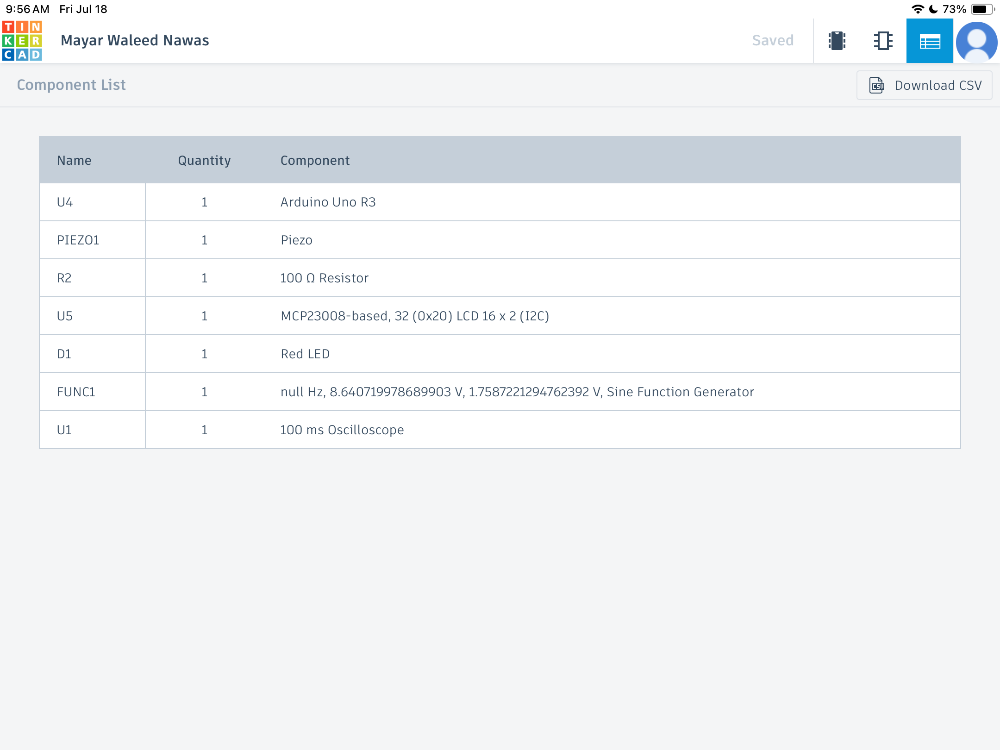
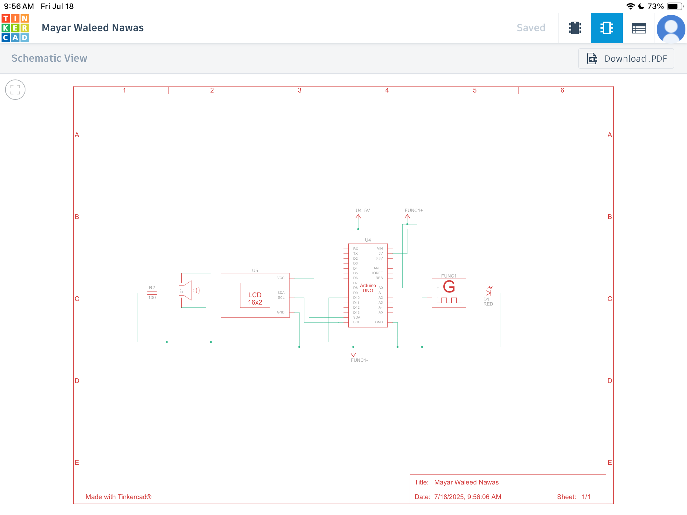
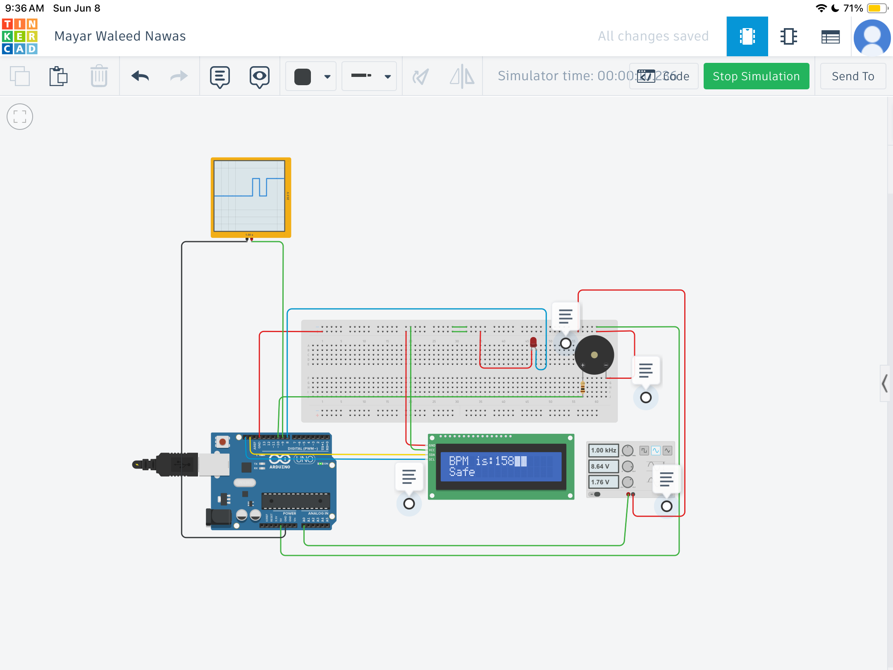

# 🏥 Arduino Healthcare Monitoring Project

This is a healthcare-related project built using **Arduino**, designed and simulated using **Tinkercad**.

The system aims to assist in health monitoring through simple electronics, demonstrating the potential of embedded systems in the medical field.

---

## 📄 Project Documentation (PDF)

All details including:
- 🔌 Circuit design
- 💻 Arduino code
- 🔗 Link to Tinkercad simulation
- 🎥 Video demonstration

Can be found here:  
👉 [Heart Rate Monitoring System Using Arduino.pdf](./Mayar%20Waleed%20Nawas%20120220147%20Heart%20Rate%20Monitoring%20System%20Using%20Arduino.pdf)

---

## 🛠 Tools & Components Used

| Name   | Quantity | Component                                                        |
|--------|----------|------------------------------------------------------------------|
| U4     | 1        | Arduino Uno R3                                                   |
| PIEZO1 | 1        | Piezo                                                            |
| R2     | 1        | 100Ω Resistor                                                    |
| U5     | 1        | MCP23008-based, LCD 16x2 (I2C Address: 0x20)                     |
| D1     | 1        | Red LED                                                          |
| FUNC1  | 1        | Sine Function Generator (null Hz, 8.64V peak, 1.76V RMS)         |
| U1     | 1        | Oscilloscope (100 ms sweep time)                                 |
---

## 📷 Project Image

The image here shows a preview of the simulation/setup.

---

## 📌 Notes

- This project is part of an academic submission in the field of **IoT in healthcare**.
- The simulation and behavior may vary depending on sensor input and timing.

---

> 👩‍⚕️ Developed by: Mayar Waleed Nawas
